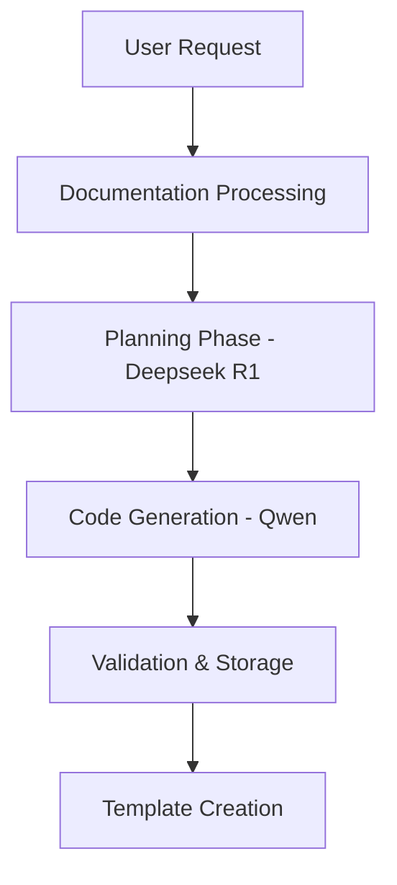

# MCP SaaS Backend

This document explains the backend flow for generating custom Model Context Protocol (MCP) servers from API documentation.

## Overview

The MCP SaaS backend is designed to automatically generate MCP servers by analyzing API documentation using advanced language models. The system uses a combination of the Deepseek R1 model for planning and the Qwen model for code generation.

## Flow Architecture



## Detailed Flow

### 1. Request Entry
Users submit a request with:
```json
{
    "documentation_url": "https://api.example.com/docs",
    "description": "Generate MCP server for Example API",
    "credentials": {
        "api_key": "example_key"
    }
}
```

### 2. Documentation Processing
- Fetches documentation using Jina Reader API
- Converts to structured Markdown format
- Extracts relevant sections and endpoints

### 3. Planning Phase (Deepseek R1)
The planning agent analyzes the documentation and creates an implementation plan:

```json
{
    "service_name": "ExampleAPI",
    "description": "MCP server for Example API integration",
    "tools": [
        {
            "name": "search_items",
            "description": "Search items in the catalog",
            "parameters": [
                {
                    "name": "query",
                    "type": "str",
                    "description": "Search query string"
                }
            ],
            "returns": "List of matching items",
            "endpoint": "/api/v1/search",
            "method": "GET"
        }
    ],
    "auth_requirements": {
        "type": "api_key",
        "credentials": ["api_key"]
    },
    "dependencies": [
        "fastmcp>=0.2.0",
        "requests>=2.31.0"
    ]
}
```

### 4. Code Generation (Qwen)
The coding agent generates the complete MCP server implementation:

```python
from mcp.server.fastmcp import FastMCP
import requests

mcp = FastMCP("ExampleAPI")

@mcp.tool()
async def search_items(query: str) -> list:
    """Search items in the catalog."""
    response = requests.get(
        "https://api.example.com/api/v1/search",
        params={"q": query},
        headers={"Authorization": f"Bearer {mcp.config.api_key}"}
    )
    response.raise_for_status()
    return response.json()

if __name__ == "__main__":
    mcp.run(transport="stdio")
```

### 5. Validation & Storage
- Validates generated code
- Creates template in database
- Stores files in `backend/templates/generated/{template_id}/`

## Environment Setup

1. Copy `.env.example` to `.env`:
```bash
cp .env.example .env
```

2. Configure environment variables:
```env
# Database Configuration
DATABASE_URL=sqlite:///./mcp_saas.db

# LLM API Keys
OPENROUTER_API_KEY=your-openrouter-api-key
JINA_API_KEY=your-jina-api-key

# Application Configuration
LOG_LEVEL=INFO
```

## Usage Example

```python
from engine.generator.llm_workflow import LLMWorkflow

# Initialize workflow
workflow = LLMWorkflow()

# Create initial state
state = {
    "user_id": "user123",
    "latest_user_message": "Generate MCP server for Example API",
    "documentation": {"url": "https://api.example.com/docs"},
    "raw_documentation": "# Example API\n## Endpoints...",
    "api_credentials": {"api_key": "example_key"}
}

# Process request
result = await workflow.process(state)

# Access generated template
template_id = result.get("template_id")
```

## Error Handling

The system includes comprehensive error handling at each stage:

1. Documentation Processing:
   - Invalid URLs
   - Inaccessible documentation
   - Malformed content

2. Planning Phase:
   - Incomplete API specifications
   - Unsupported authentication methods
   - Invalid endpoint definitions

3. Code Generation:
   - Invalid implementation plans
   - Missing dependencies
   - Syntax errors

4. Validation:
   - Code validation failures
   - Database errors
   - File system errors

Each error is logged and propagated with appropriate context for debugging.

## Dependencies

Key dependencies include:
- FastMCP: Core MCP server framework
- LangGraph: Workflow orchestration
- OpenAI/OpenRouter: LLM integration
- Jina AI: Documentation processing
- SQLAlchemy: Database operations

## Development

To run the backend in development mode:

```bash
uvicorn main:app --reload --port 8000
```

For testing:

```bash
pytest tests/
``` 