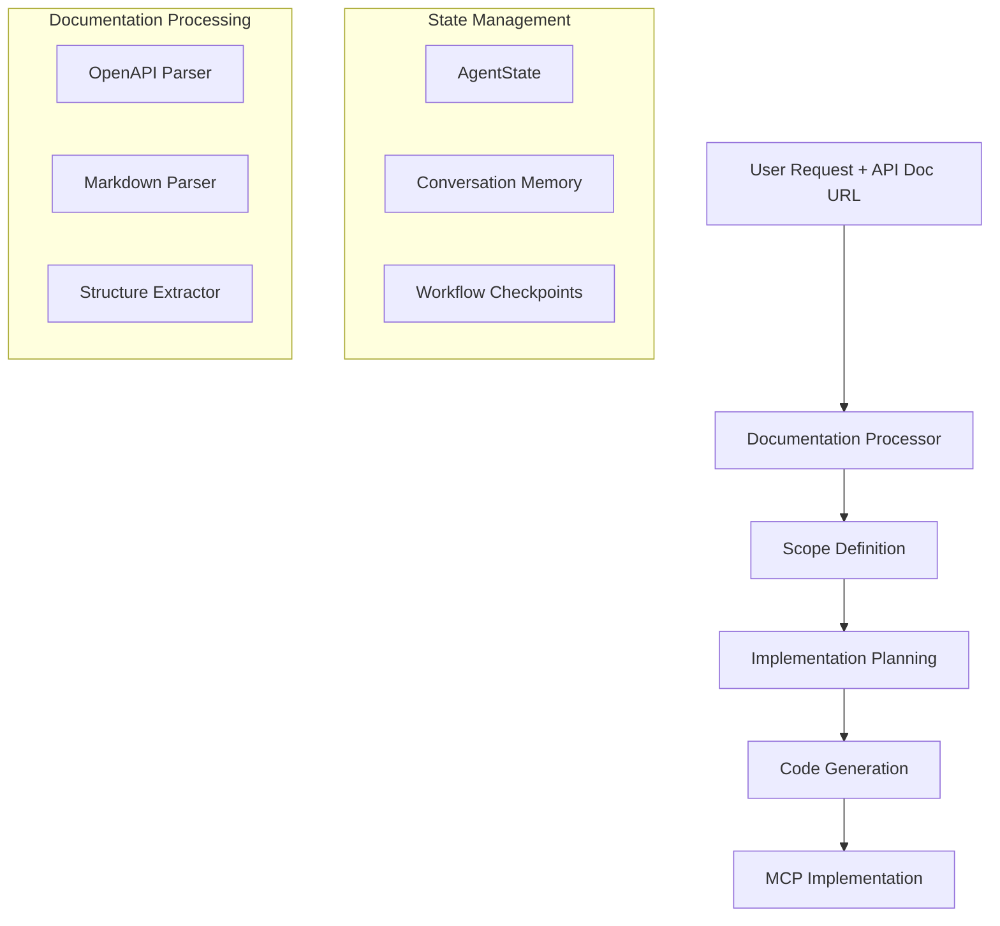
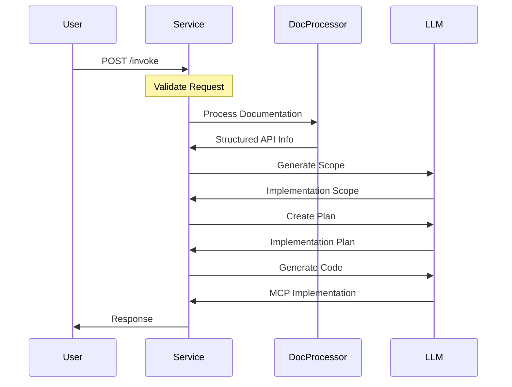
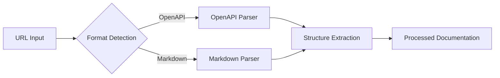

# FastMCP Template for API Integration

A flexible template for creating Model Context Protocol (MCP) servers that can automatically integrate new APIs into the Cursor IDE ecosystem. This template is specifically designed to handle the common use case where developers want to integrate a new API service by providing its documentation URL.

## Core Philosophy

This template addresses a specific gap in the MCP ecosystem: the need to quickly create new API integrations. While existing MCPs (like Google Drive or Figma) serve specific services, this template enables rapid development of new API integrations by:

1. Automatically processing API documentation
2. Understanding API structure and requirements
3. Generating appropriate MCP implementations
4. Following FastMCP framework best practices

## Architecture Overview



## Core Components

### 1. Service Layer (`service.py`)

The service layer implements the FastAPI application and defines the core workflow:

```python
class AgentState(TypedDict):
    latest_user_message: str
    messages: List[bytes]
    scope: str
    documentation: Dict[str, Any]
    implementation_plan: str
```

Key features:
- Uses `langgraph` for workflow management
- Implements state persistence with `MemorySaver`
- Handles both first-time and continuation requests
- Structured error handling and validation

Workflow Nodes:
1. `process_documentation`: Initial documentation processing
2. `define_scope`: Determines implementation scope
3. `create_implementation_plan`: Creates detailed plan
4. `generate_code`: Generates MCP implementation

### 2. Documentation Processor (`doc_processor.py`)

A sophisticated documentation processing system that handles multiple formats:

```python
class DocProcessor:
    async def process_url(self, url: str) -> Dict[str, Any]:
        # Automatic format detection and processing
```

Features:
- OpenAPI (JSON/YAML) support
- Markdown documentation parsing
- Automatic format detection
- Structured information extraction
- Async HTTP client for efficient fetching
- Error handling and validation

Processing Capabilities:
- API endpoint extraction
- Parameter parsing
- Response structure analysis
- Code sample extraction
- Section organization

### 3. Dependencies (`requirements.txt`)

Carefully selected dependencies for optimal functionality:

```plaintext
fastapi         # Web framework
uvicorn        # ASGI server
langgraph      # Workflow management
httpx          # Async HTTP client
pyyaml         # YAML processing
beautifulsoup4 # HTML/XML parsing
markdown       # Markdown processing
openai         # LLM integration
pydantic       # Data validation
fastmcp        # MCP framework
```

## Workflow Details

### 1. Initial Request Flow



### 2. State Management

The template uses a sophisticated state management system:

1. **Conversation State**:
   - Tracks message history
   - Maintains documentation context
   - Preserves implementation decisions

2. **Workflow State**:
   - Managed by `langgraph`
   - Checkpointing with `MemorySaver`
   - Recoverable processing state

### 3. Documentation Processing Flow



## Implementation Details

### 1. Error Handling

The template implements comprehensive error handling:

```python
try:
    if request.is_first_message and not request.doc_url:
        raise HTTPException(status_code=400, detail="Documentation URL required")
except Exception as e:
    raise HTTPException(status_code=500, detail=str(e))
```

### 2. Documentation Processing

Multiple format support with specialized processors:

1. **OpenAPI Processing**:
   - JSON/YAML format detection
   - Schema validation
   - Endpoint extraction
   - Parameter parsing

2. **Markdown Processing**:
   - Section extraction
   - Code block parsing
   - Endpoint detection
   - Structure analysis

### 3. State Management

Robust state management using TypedDict:

```python
class AgentState(TypedDict):
    latest_user_message: str    # Current request
    messages: List[bytes]       # History
    scope: str                  # Implementation scope
    documentation: Dict[str, Any] # Processed docs
    implementation_plan: str    # Detailed plan
```

## Usage Examples

1. **First-Time Request**:
```json
{
    "message": "Create MCP for Weather API",
    "doc_url": "https://api.weather.com/docs/openapi.json",
    "thread_id": "new_thread",
    "is_first_message": true
}
```

2. **Follow-up Request**:
```json
{
    "message": "Add support for forecast endpoints",
    "thread_id": "existing_thread",
    "is_first_message": false
}
```

## Best Practices

1. **Documentation Processing**:
   - Always validate documentation URLs
   - Handle multiple formats gracefully
   - Extract structured information
   - Preserve context and relationships

2. **State Management**:
   - Use typed state definitions
   - Implement proper checkpointing
   - Maintain conversation context
   - Handle state transitions

3. **Error Handling**:
   - Validate all inputs
   - Provide meaningful error messages
   - Implement proper recovery
   - Log important events

## Development Guidelines

1. **Adding New Features**:
   - Extend state definitions as needed
   - Add new workflow nodes systematically
   - Update documentation processing
   - Maintain type safety

2. **Testing**:
   - Test documentation processing
   - Validate workflow transitions
   - Check error handling
   - Verify state management

3. **Deployment**:
   - Use environment variables
   - Configure proper logging
   - Set up monitoring
   - Handle scaling considerations

## Future Enhancements

1. **Documentation Processing**:
   - Support more formats
   - Enhance extraction accuracy
   - Add validation rules
   - Improve error recovery

2. **Workflow Management**:
   - Add branching workflows
   - Enhance state persistence
   - Implement rollback
   - Add validation steps

3. **Code Generation**:
   - Improve template matching
   - Add more patterns
   - Enhance type safety
   - Support more frameworks

## Contributing

1. Fork the repository
2. Create a feature branch
3. Implement changes
4. Add tests
5. Submit pull request

## License

MIT License - See LICENSE file for details 